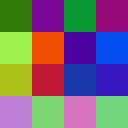

# UUID To Image

Generate images based on UUIDs for quickly identifying the same UUID on slack bot message streams etc.

Produces unique-enough images for most use cases.

It probably also works for other random input strings but it works best with UUIDs.



# Example

```go
package main

import (
	"github.com/synecy/uuid2img"
)

func main() {
    uuid2img.GenerateFile("16fd2706-8baf-433b-82eb-8c7fada847da", "sample.png")
}
```
